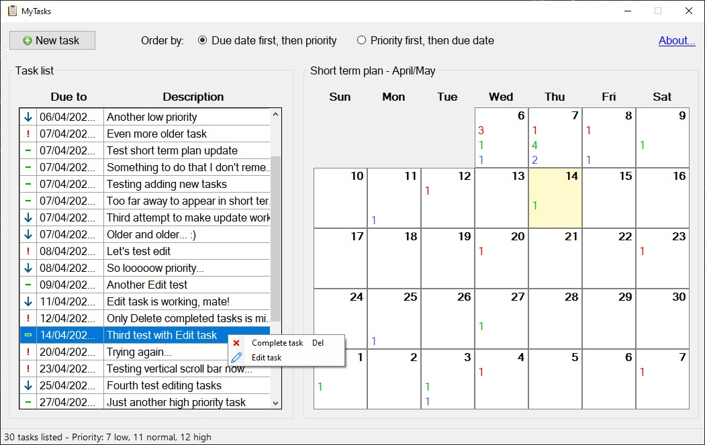

# About

A simple short term to do list. Database is a XML file, since there is no such huge amount of data.

# To be implemented

* Implement sorting options.
* Edit tasks.
* Remove completed tasks.

# Known issues

* When any day is clicked in Short Term Plan, several days (including the one clicked) have their contents deleted. I guess it happens due to the disable/enable used in each one to avoid showing the cursor inside the RichTextBox object.
